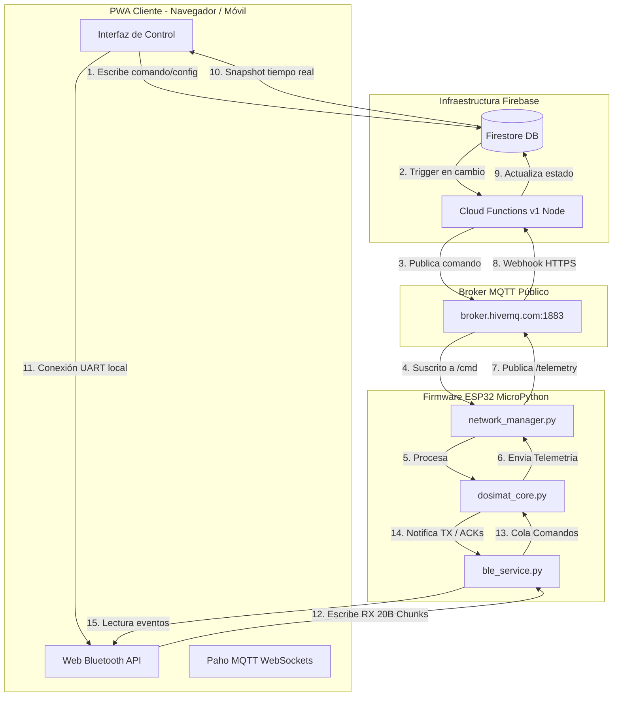

# Dosimat IoT V2 - Manual de Arquitectura de Comunicación (Handoff)

Este documento detalla la arquitectura de comunicación híbrida del Dosimat IoT V2 entre la Aplicación Web Progresiva (PWA) y el firmware MicroPython del ESP32. Sirve como referencia técnica para diagnosticar y depurar flujos de datos.

---

## 1. Comunicación vía Nube (WiFi / Firestore / MQTT)

Cuando la PWA opera en **Modo Nube**, la base de datos Firestore actúa como intermediario persistente. El puente físico con el ESP32 se realiza a través de un Broker MQTT y Firebase Cloud Functions.

### A. Flujo de Comandos (PWA ➔ ESP32)
1. La PWA escribe en Firestore:
   - Comandos de control directos: Se escriben en `equipos/{CHIP_ID}/estado/actual` en los campos `comando_solicitado` y `refuerzo_solicitado`.
   - Parámetros de configuración: Se escriben en `equipos/{CHIP_ID}/config/actual`.
   - Cronograma de filtrado: Se escribe en `equipos/{CHIP_ID}/programas/actual`.
2. Las **Cloud Functions** (`onEstadoWrite`, `onConfigWrite`, `onProgramasWrite`) detectan la escritura, verifican roles/permisos del usuario, compilan el payload JSON y lo publican en el Broker MQTT `broker.hivemq.com` en el puerto `1883`.
   - **Topic de Comandos**: `dosimat/{CHIP_ID}/cmd`
3. El ESP32 recibe el JSON y lo ejecuta en `dosimat_core.procesar_comando()`.

### B. Flujo de Telemetría y Logs (ESP32 ➔ PWA)
1. El ESP32 publica telemetría y logs de eventos en formato JSON en el Broker MQTT.
   - **Topic de Telemetría**: `dosimat/{CHIP_ID}/telemetry`
   - **Topic de Logs**: `dosimat/{CHIP_ID}/sys_log`
2. El webhook HTTPS de la Cloud Function (`mqttWebhook`) escucha este broker, parsea el JSON y actualiza el estado en Firestore:
   - Telemetría ➔ `equipos/{CHIP_ID}/estado/actual`.
   - Logs ➔ Colección `equipos/{CHIP_ID}/logs/{LOG_ID}`.
3. La PWA, mediante listeners en tiempo real (`onSnapshot`), recibe los cambios y actualiza la UI.
4. *Optimización*: Si la PWA está en línea, también se suscribe directamente mediante WebSockets (`Paho.MQTT`) al topic `dosimat/{CHIP_ID}/telemetry` para reaccionar inmediatamente a los ACKs de comandos.

---

## 2. Comunicación Local (Bluetooth Low Energy - BLE)

Cuando el equipo no tiene WiFi o la PWA no tiene acceso a internet, se utiliza la conexión directa mediante **Web Bluetooth API** (Nordic UART Service).

### A. Configuración del Servicio GATT
- **Service UUID**: `6e400001-b5a3-f393-e0a9-e50e24dcca9e` (Nordic UART)
- **RX Characteristic UUID** (PWA escribe ➔ ESP32 recibe): `6e400002-b5a3-f393-e0a9-e50e24dcca9e` (Propiedades: `Write` o `Write Without Response`).
- **TX Characteristic UUID** (ESP32 notifica ➔ PWA recibe): `6e400003-b5a3-f393-e0a9-e50e24dcca9e` (Propiedades: `Notify`).

### B. Protocolo de Fragmentación (Chunking)
Debido a que el tamaño de MTU estándar en Bluetooth LE se restringe a **20 bytes útiles**:
- **PWA a ESP32**: La PWA serializa el JSON, añade un salto de línea (`\n`), lo divide en trozos de 20 bytes y los escribe en la característica RX espaciados por **45ms** para no desbordar el buffer del microcontrolador.
- **ESP32 a PWA**: El firmware serializa el JSON, añade `\n`, lo divide en fragmentos de 20 bytes y realiza llamadas `.notify()` consecutivas separadas por **40ms** en `ble_service.send_json_async()`.
- **Estructuración**: El receptor de ambos lados acumula los datos en un buffer de texto hasta encontrar el carácter `\n`, momento en el cual realiza el `JSON.parse()`.

---

## 3. Diccionario de Comandos y Respuestas (Payloads)

### A. Comandos de Control Inmediato
- **Iniciar Ciclo**: `{"comando": "START_CYCLE", "refuerzo": true/false}`
- **Pausar Ciclo**: `{"comando": "PAUSE_CYCLE"}`
- **Reanudar Ciclo**: `{"comando": "RESUME_CYCLE"}`
- **Cancelar Ciclo**: `{"comando": "CANCEL_CYCLE"}`
- **Antiatasco Manual**: `{"comando": "RUN_ANTI"}`
- **Reset de Fábrica**: `{"comando": "FACTORY_RESET"}`

### B. Sincronización y Configuración
- **Configuración de WiFi**: `{"comando": "config_wifi", "ssid": "NombreRed", "pass": "Contrasenia"}`
  - *ACK de Confirmación*: `{"tipo": "ACK_WIFI", "ssid": "NombreRed"}`
- **Parámetros de Tiempos**: `{"comando": "UPDATE_CONFIG", "config": {"config_version": 172138403, "tespera_seg": 5400, "tdosis_seg": 90, "ajuste_baja": 50, "temporada_alta_inicio": "10-15", "temporada_alta_fin": "03-30"}}`
  - *ACK de Confirmación*: `{"tipo": "ACK_CFG", "v": 172138403}`
- **Sincronización RTC**: `{"comando": "sync_rtc", "fecha": "2026-07-19", "hora": "08:30"}`
  - *ACK de Confirmación*: `{"tipo": "ACK_RTC", "status": "OK"}`
- **Descargar Logs**: `{"comando": "GET_LOGS"}`
  - *Respuesta*: Múltiples paquetes `{"tipo": "LOG_ENTRY", "data": {...}}` finalizando con `{"tipo": "LOGS_END"}`.
- **Limpiar Logs**: `{"comando": "CLEAR_LOGS"}`
  - *ACK de Confirmación*: `{"tipo": "ACK_CLEAR_LOGS"}`

### C. Transferencia Segmentada de Cronogramas (Sólo por BLE)
1. Iniciar Envío: `{"comando": "cron_start", "total": N}`
   - *ACK*: `{"tipo": "ACK_CRON_START"}`
2. Transferir Horarios (repetir por cada uno): `{"comando": "cron_add", "idx": 0, "on": "0900", "duracion": 60, "dosis": 0, "dias": "0123456"}`
   - *ACK*: `{"tipo": "ACK_CRON_ADD", "idx": 0}`
3. Confirmar y Guardar: `{"comando": "cron_commit"}`
   - *ACK*: `{"tipo": "ACK_CRON", "status": "OK"}`

---

## 4. Lógica de Bloqueo de UI y Rollback (Pessimistic UI)

Para garantizar la sincronía física (que la PWA nunca muestre estados que el equipo no ha ejecutado realmente), se implementa un control transaccional estricto en `app/app.js`:

1. **Estado Pendiente**: Al modificar un switch o presionar guardar, se deshabilitan todos los botones e inputs asociados y se guarda el estado anterior del control.
2. **Timeout de 5 Segundos**: Se inicia una cuenta atrás de 5000ms (10000ms para cronogramas BLE debido al retardo de transmisión por fragmentos).
3. **Confirmación**: Si el ESP32 emite el ACK correspondiente o la telemetría refleja el estado solicitado antes de que expire el tiempo:
   - Se limpia el timeout.
   - Se reactivan los inputs conservando el nuevo estado.
   - Se muestra un toast de éxito.
4. **Reversión (Rollback)**: Si el temporizador expira sin confirmación:
   - Se alerta al usuario: *"El dosificador no respondió a la orden."*
   - Se vuelve a poner el switch o input en su valor anterior almacenado en la memoria caché (`lastConfigData`, `lastCronogramaData` o el estado previo del switch).
   - Se liberan y rehabilitan los controles.

---

## 5. Diagnóstico de Errores Comunes

| Síntoma | Causa Probable | Método de Diagnóstico / Solución |
| :--- | :--- | :--- |
| **Los switches vuelven a su posición anterior en 5 segundos** | El ESP32 no recibió la orden o no pudo responder el ACK a tiempo. | 1. Comprobar si el LED de red parpadea lento (Sin WiFi). 2. Abrir consola del navegador para verificar si las funciones de Firebase están respondiendo o hay un error de red en WebSockets. 3. Verificar si el ESP32 está conectado al mismo Broker MQTT. |
| **No se abre el diálogo de escaneo Bluetooth en Chrome** | Restricción de seguridad del navegador. | La Web Bluetooth API exige estrictamente cargar el sitio bajo protocolo seguro **HTTPS** o usando **localhost**. Si cargas la app por HTTP IP, el botón no funcionará. |
| **El ESP32 recibe JSON corrupto o corta los comandos BLE** | Fallo en el delimitador o retardo de envío. | 1. Verificar en `app.js` que el retardo del loop de transmisión de chunks no sea inferior a 45ms. 2. Validar que la cadena enviada finalice siempre con el terminador de línea `\n`. |
| **El RTC del ESP32 vuelve al año 2000 tras un apagón** | Batería del DS3231 agotada o mala conexión I2C. | Revisar los logs en el terminal de la PWA. Al bootear, el ESP32 imprime en consola: `[CORE] Hora del sistema inicializada desde DS3231 física` o arroja error de I2C. |
