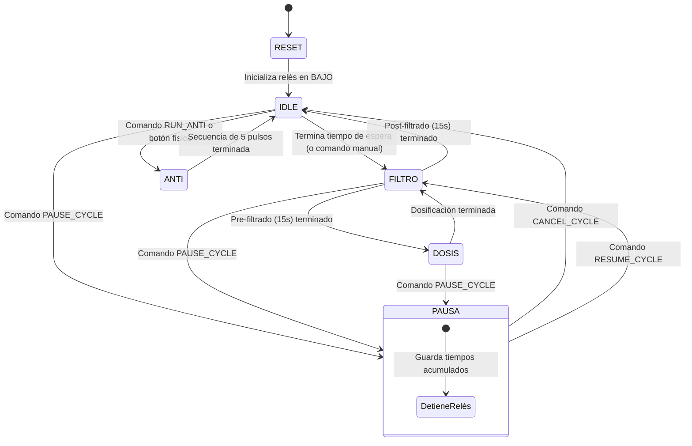

# Dosimat IoT V2 - Especificaciones Técnicas y Manual de Transferencia (Handoff)

Este documento centraliza todas las especificaciones de diseño, lógica funcional del hardware, comportamiento de la PWA, modelo de seguridad (roles) e integración del sistema Dosimat IoT V2.

---

## 1. Lógica Funcional del Hardware (MicroPython en ESP32)

El ESP32 actúa como controlador principal y ejecuta una máquina de estados no bloqueante basada en `uasyncio`.



### A. Estados del Dosificador (`dispenser_loop` en `dosimat_core.py`)

1.  **RESET**: Apaga inmediatamente los relés de potencia al energizarse o ante un reinicio inesperado por WDT.
2.  **IDLE (En Espera)**: Fase inactiva. Lee el parámetro "Tiempo de Espera" (por defecto 1h 30m) y decrementa segundo a segundo.
3.  **FILTRO (Filtrando)**: Se enciende la bomba de filtrado (Relé Bomba = 1, Válvula = 0).
    - **Pre-filtrado (15 segundos)**: Estabiliza el flujo hidráulico antes de inyectar producto.
    - **Post-filtrado (15 segundos)**: Lavado de conductos y tuberías de la piscina después de dosificar.
4.  **DOSIS (Dosificando Cloro)**: Se encienden la bomba y la válvula dosificadora (Bomba = 1, Válvula = 1) durante el "Tiempo de Dosis".
5.  **PAUSA (Mantenimiento)**: Apaga ambos relés. Guarda el tiempo restante de la fase interrumpida y espera un comando de reanudación (`RESUME_CYCLE`) o cancelación (`CANCEL_CYCLE`).
6.  **ANTI (Antiatasco)**: Ejecuta una rutina de liberación física de la válvula solenoide (2 ciclos de 4 segundos: 3s encendido, 1s apagado).

### B. Cálculo de Dosis por Temporada

- **Temporada Alta (Verano)**: Si la fecha del sistema cae en el rango configurado (ej: 15/10 al 30/03), la dosificación se ejecuta al **100% de la duración** configurada.
- **Temporada Baja**: Si la fecha está fuera de rango, la duración de la dosis se reduce automáticamente aplicando el **porcentaje de ajuste** (deslizable de 0 a 100%, por omisión 50%).
- _Excepción_: Si el **Modo Refuerzo** está activo, se ignora la temporada baja y se inyecta el doble de la dosis de temporada alta en el siguiente ciclo.

### C. Mapeo de Hardware

- **Bomba de Filtrado (Relé)**: Pin 23 (Activo en Alto).
- **Válvula Dosificadora (Relé)**: Pin 25 (Activo en Alto).
- **LED del Panel**: Pin 2 (Salida de diagnóstico visual).
- **RTC Físico (DS3231)**: Conectado a través de SoftI2C en SDA = Pin 21, SCL = Pin 22.

---

## 2. Modelo de Datos y Seguridad (Roles en Firebase)

La seguridad y control de accesos se gestiona directamente en Firestore mediante validaciones de roles a nivel de base de datos (`firestore.rules`) y en las Cloud Functions.

```
                  [ Proveedores de Auth ]
                   /                 \
             Email/Contraseña      Google Auth
                     \             /
                    [ Colección usuarios ]
                              |
                    (Tiene campo id_equipo)
                              |
         +--------------------+--------------------+
         |                                         |
[ Propietarios ]                            [ Personal Técnico ]
(Colección /equipos/{id}/)                  (Documento /roles/tecnicos)
- Acceso total de control.                  - Permisos de lectura/diagnóstico.
- Administra WiFi y tiempos.                - No puede hacer Factory Reset.
```

### A. Roles Soportados

1.  **Propietario (Owner)**: Usuario asignado a un dosificador.
    - Ubicación en BD: `/equipos/{chipId}/propietarios/{uid}` con el campo `{activo: true}`.
    - Permisos: Modificar tiempos, configurar WiFi, guardar cronogramas, ejecutar ciclos manuales y realizar Factory Reset.
2.  **Técnico**: Personal de mantenimiento oficial.
    - Ubicación en BD: `/roles/tecnicos` (documento con mapa de `uid: true`).
    - Permisos: Ver telemetría, ver historial de logs, cambiar tiempos de filtrado. No se le permite iniciar un `FACTORY_RESET` bajo ningún motivo.
3.  **Super Admin**: Administradores de fábrica de DOSIMAT.
    - Ubicación en BD: `/roles/super_admin` (documento con mapa de `uid: true`).
    - Permisos: Bypass total en cualquier verificación. Puede vincular/desvincular cualquier hardware de forma global.

---

## 3. Especificaciones de la Interfaz Web (PWA)

La interfaz se despliega como una SPA (Single Page Application) limpia y responsiva.

### A. Pantallas del Navegador (Navegación Inferior)

1.  **Dashboard**:
    - Estado Operativo en tiempo real (En espera, Filtrado, Dosificando, Pausado, Antiatasco, Offline).
    - LED Virtual animado parpadeante sincronizado con el microcontrolador.
    - Indicadores rápidos: Estado de bomba (ON/OFF), Refuerzo activo (ON/OFF), Temperatura de placa (°C) y **Próxima Dosis** (formato: `Hoy/Mañana HH:MM (Duración de Dosis en min y seg)`).
    - Fila de switches con confirmación por hardware (Bomba, Dosis Manual, Modo Refuerzo, Pausa Mantenimiento).
2.  **Programar**:
    - **Tiempos del Dosificador**: Campos de entrada para "Tiempo de Espera" y "Duración de Dosis" en minutos y segundos. Slider de 0 a 100% de reducción para temporada baja. Selectores desplegables DD-MM para inicio y fin de temporada alta (por defecto 15/10 al 30/03).
    - **Cronograma de Filtrado**: Permite agregar hasta 10 filas de horarios. Cada fila contiene campos etiquetados de _Hora Inicio_, _Duración (min)_ y checkbox para _Dosificar Cloro_, además de los selectores circulares de días de la semana (L, M, X, J, V, S, D).
    - **Botón Programa Automático**: Borra la configuración del cronograma local y precarga:
      - `09:00` ➔ 60 min, todos los días, sin dosis.
      - `14:00` ➔ 60 min, todos los días, sin dosis.
      - `21:00` ➔ 60 min, todos los días, con dosis.
3.  **Ajustes**:
    - Botón _"Buscar Dosificador por BLE"_ para forzar vinculación Bluetooth.
    - Cajas de configuración WiFi local (SSID y Contraseña con icono de visibilidad de contraseña).
4.  **Historial**:
    - Consola de diagnóstico en vivo que lista los logs operativos descargados desde el equipo (fases, duraciones, alertas y errores).
5.  **Ayuda**:
    - Acceso a canales de soporte técnico (WhatsApp, Email).
    - Tarjeta de Diagnóstico de hardware (MAC del chip, temporada activa y hora RTC del ESP32).
    - Botón de Restablecimiento de Fábrica (Pide confirmación visual).

---

## 4. Flujos de Comunicación y Protocolo

### A. Canal de Enlace Dual

- **WiFi / Nube**: PWA ➔ Firestore ➔ Cloud Functions ➔ MQTT Broker (`broker.hivemq.com:1883`) ➔ ESP32.
- **BLE Local**: PWA ➔ Web Bluetooth ➔ Nordic UART GATT ➔ ESP32.
  - _Service UUID_: `6e400001-b5a3-f393-e0a9-e50e24dcca9e`
  - _RX (Write No Response)_: `6e400002-b5a3-f393-e0a9-e50e24dcca9e`
  - _TX (Notify)_: `6e400003-b5a3-f393-e0a9-e50e24dcca9e`

### B. Segmentación de Datos (BLE MTU 20 Bytes)

El tamaño del buffer BLE está restringido. Las tramas JSON grandes se dividen en fragmentos de 20 bytes con retrasos de transmisión de 45ms. El receptor concatena los trozos hasta encontrar el terminador `\n`.

### C. Bloqueo de UI y Rollback (Pessimistic UI)

Para evitar discrepancias entre la pantalla y el estado del hardware físico, todas las órdenes (switches de control, parámetros de tiempos, cronogramas y red WiFi) bloquean la interfaz al enviarse y ejecutan un temporizador de 5 segundos.

- Si el ESP32 no responde con su respectivo paquete de confirmación (ACK) o telemetría de cambio de estado en ese lapso de tiempo, la app deshace los cambios visuales volviendo al estado real confirmado anterior (`lastConfigData` o `lastCronogramaData`) y muestra una alerta: _"El dosificador no respondió a la orden."_
